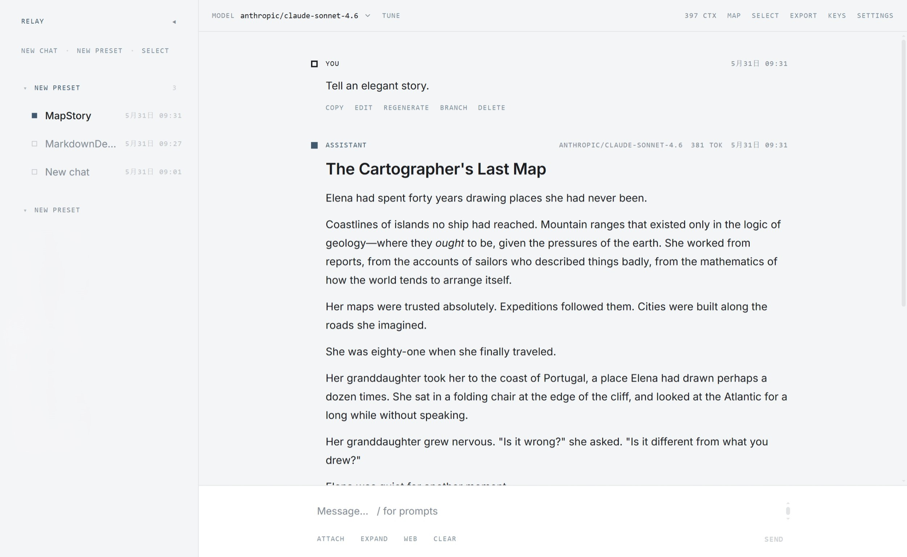

# Relay

A light, fast, browser-based multi-provider LLM chat app for personal use — a
quieter, prettier alternative to Cherry Studio. Local-first: your data lives in a
single JSON file on your own disk, and the network is used only for LLM calls and
optional WebDAV sync.

Works with any OpenAI-compatible provider (OpenRouter, OpenAI, Groq, local
servers, Gemini AI Studio) and Google Vertex AI. Streaming, branching
conversations, markdown/code/math, file uploads, web search, presets, and export.



## Run with Docker

One command, no clone and no Node toolchain:

```bash
docker run -d --name relay -p 8787:8787 -v relay-data:/data \
  ghcr.io/qingpy/relay:latest
```

Open http://localhost:8787. All your data — the snapshot, API keys, and backups —
lives in the `relay-data` volume. To keep it in a folder you can see, use a bind
mount instead: `-v /path/on/host:/data`.

Run it locally only. The proxy has no authentication, so don't expose port 8787
to the internet — anyone who reaches it can use your stored keys.

## Run from source

Requires Node 20+.

```bash
npm install
npm run dev      # Vite + proxy; open http://localhost:5173
```

Production single-origin build:

```bash
npm run build
npm run serve    # serves the built app + API; open http://localhost:8787
```

The proxy must be running — it owns your data file. Other scripts: `npm run
typecheck`, and `npm run dev:web` / `npm run dev:server` to run one half.

## Your data

The source of truth is one JSON file on disk, owned by the proxy. The browser uses
an in-memory store, so nothing persists to your browser profile.

- Default path: `./data/relay.json`; override with `RELAY_DATA_FILE`.
- The exact path and size show in Settings → Sync & backup.

Secrets stay out of that file. API keys, the Vertex private key, and the WebDAV
password live in a separate proxy-owned store (`RELAY_SECRETS_FILE`, a per-user
config dir by default). The data file, backups, and WebDAV mirror are
credential-free and safe to copy around; restoring on a new device re-enters keys.

For cross-device use, mirror the snapshot to your own WebDAV server (optional,
last-write-wins, syncs while the app is open). WebDAV can also keep a rolling set
of timestamped backups. Portable JSON backups, by download or on disk, are
available too.

## Providers

No login. In Settings → Connections, add a connection:

- Custom: paste a full OpenAI-compatible API URL (e.g. `…/v1/chat/completions`)
  and an API key. Covers OpenRouter, OpenAI, Groq, local servers, and Gemini's
  OpenAI-compatible endpoint.
- Vertex AI: upload or paste a service-account JSON; the key stays server-side.

A preset then fixes the model, parameters, and system prompt for its chats.
Per-model capabilities (vision, PDF, reasoning, web, tools) gate the composer.

## Environment variables

All optional.

| Variable                              | Purpose                                   | Default             |
| ------------------------------------- | ----------------------------------------- | ------------------- |
| `RELAY_DATA_FILE`                     | Data snapshot path                        | `./data/relay.json` |
| `RELAY_SECRETS_FILE`                  | Secret store (keys + WebDAV password)     | per-user config dir |
| `API_PORT`                            | Proxy port                                | `8787`              |
| `RELAY_BACKUP_DIR`                    | On-disk backup folder                     | `./backups`         |
| `OPENROUTER_KEY` / `OPENAI_KEY`       | Fallback key for OpenAI-style connections | —                   |
| `GOOGLE_VERTEX_CREDENTIALS` / `_FILE` | Fallback Vertex service-account           | —                   |

## Stack

React 19, TypeScript (strict), Vite 6, Tailwind v4, shadcn/Radix, Dexie over an
in-memory IndexedDB, Zustand, and a Hono proxy on Node. Few dependencies — prefer
the platform over libraries.

See ARCHITECTURE.md for how Relay is built.
