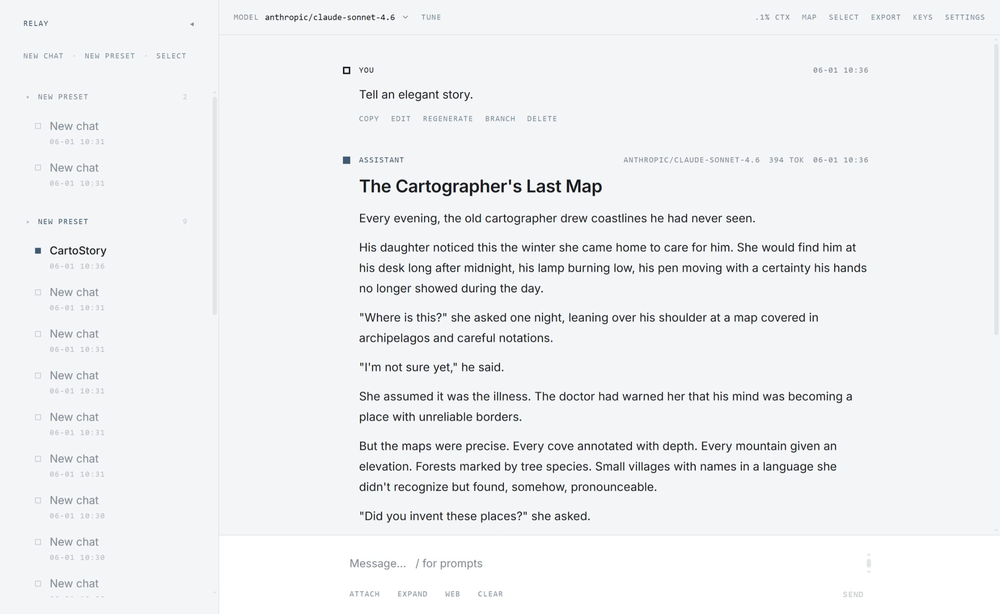

# Relay

[English](README.md) | 中文

个人用的网页 LLM 聊天，接 OpenAI 兼容接口和 Google Vertex AI。
数据是磁盘上一个 JSON；网络只用来调模型和可选的 WebDAV。



## 运行

Docker：

```bash
docker run -d --name relay -p 8787:8787 -v relay-data:/data \
  ghcr.io/qingpy/relay:latest
```

打开 http://localhost:8787。数据、密钥、备份在 `relay-data` 卷里；想放在
普通目录就用 `-v /path/on/host:/data`。没有 HTTP 鉴权，只绑你信任的网络。

压缩包（Node 20+）：从[最新 Release](https://github.com/qingpy/relay/releases/latest)
下载 `relay-x.y.z.zip`，解压后 `node server-dist/index.js`。

源码（Node 20+）：

```bash
npm install
npm run dev      # http://localhost:5173
```

`npm run build && npm run serve` 会在 :8787 同时提供界面和 API。

## 数据

默认文件 `./data/relay.json`（路径在 设置 → Sync & backup）。API key、Vertex
私钥、WebDAV 密码在单独文件里，拷贝 JSON 不会带出凭据。

设置 → Connections：填完整的 `…/v1/chat/completions` 地址和 key，或粘贴
Vertex 服务账号 JSON。

同一页可开 WebDAV：应用打开时同步文件，后写覆盖。磁盘备份在 `./backups`。

## 环境变量

都可省略。

| 变量 | 默认 |
| --- | --- |
| `RELAY_DATA_FILE` | `./data/relay.json` |
| `RELAY_SECRETS_FILE` | `%APPDATA%\Relay\secrets.json` 或 `~/.config/relay/secrets.json` |
| `API_PORT` | `8787` |
| `RELAY_BACKUP_DIR` | `./backups` |
| `OPENROUTER_KEY` / `OPENAI_KEY` | OpenAI 式连接的后备 key |
| `GOOGLE_VERTEX_CREDENTIALS` / `_FILE` | 后备 Vertex 服务账号 |

细节见 [ARCHITECTURE.md](ARCHITECTURE.md)。

感谢 [linux.do](https://linux.do/) 社区。
